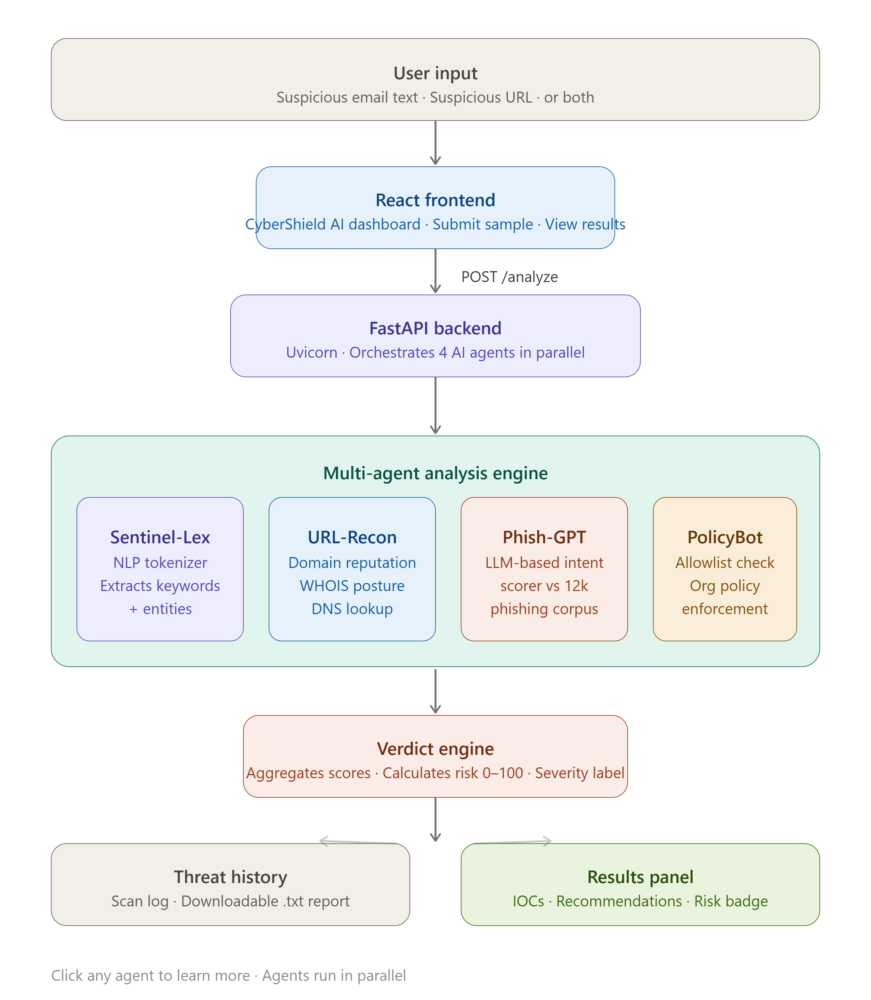

# CyberShield AI

AI-powered cybersecurity assistant developed for the Microsoft Agents League Hackathon.

## Features
- Phishing Detection
- URL Analysis
- Threat Intelligence
- Multi-Agent AI Reasoning

## Tech Stack
- React
- FastAPI
- Python
- GitHub

## Architecture

## Demo
(Add demo video link here)

## Presentation
[CyberShield-AI Micro PPT](CyberShield-AI%20micro%20ppt.pdf)

## Author
Priti Ranjit
